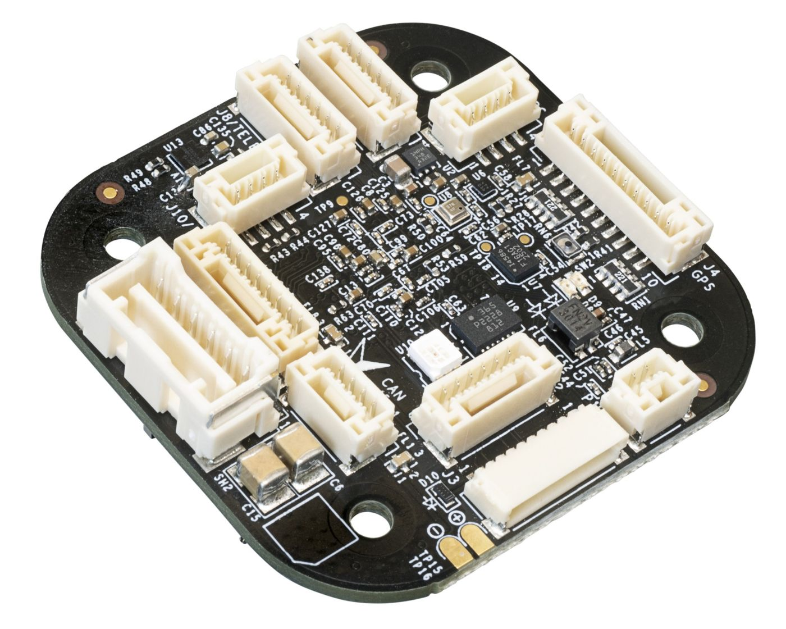
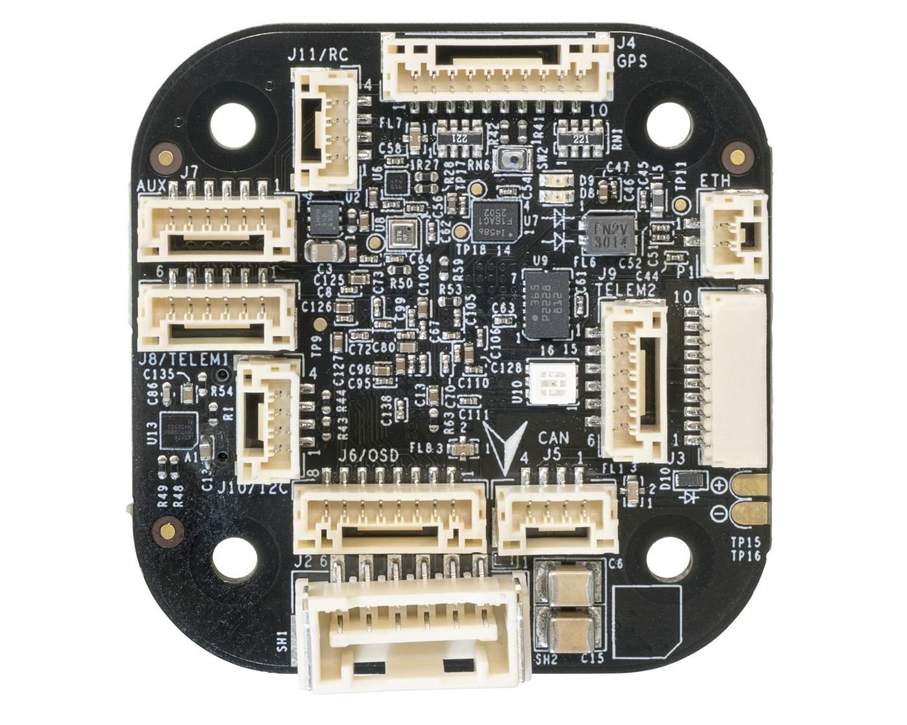
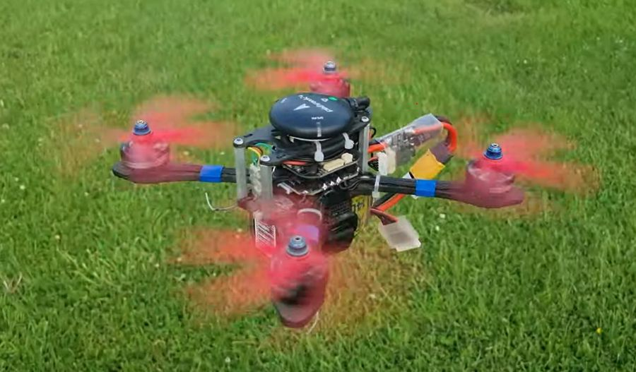

# MR-VMU-Tropic

MR-VMU-Tropic (Vehicle Management Unit) is an Open-Source base board designed around the [NXP i.MX RT1064 MCU](https://www.nxp.com/products/i.MX-RT1064).

MR-VMU-Tropic Side view     |  MR-VMU-Tropic Top view
:-------------------------:|:-------------------------:
  |  

MR-VMU-Tropic is capable of running autopilot software for unmanned vehicles such as:
 - Drones
 - Rovers
 - Boats
 - And more

## Drone Test flight Video

# Software

The MR-VMU-Tropic supports multiple Autopilots, please check the individual guide below

 - [Cognipilot setup guide](./Cognipilot.md)
 - [PX4 Autopilot setup guide](./PX4_Autopilot.md)

Tropic VMU also supports Zephyr RTOS with most of it's peripherals enabled.

> [!NOTE]  
> We're still in the process of upstreaming code please check the open pull requests in the corresponding projects

# Hardware

MR-VMU-Tropic design is based around the [NXP MIMXRT1064DVJ6B](https://www.nxp.com/products/i.MX-RT1064) which provides:

- Cortex-M7 600MHz
- 1024K RAM (512 Tightly coupled)
- 4MB Flash
- 100Mbps Ethernet
- USB HS 480Mbit/s
- SD Card interface

MR-VMU-Tropic board consisting of:

- Bosch BMI088 IMU
- Bosch BMM350 Magnetometer 
- Bosch BMP390 Barometer
- TDK InvenSense ICM-45686 IMU
- CAN-FD with a NXP TJA1462ATK CAN Transceiver
- 100BASE-T1 Ethernet using the [TJA1103](https://www.nxp.com/products/TJA1103)
- RGB Led

With connectors for:

| Name                        | Connector Type         | Functionality                                                               | Pinout                                                                 |
|-----------------------------|------------------------|-----------------------------------------------------------------------------|------------------------------------------------------------------------|
| GPS                        | 10-pin JST-GH          | GNSS module connection                                                       | VCC, TX, RX, SCL, SDA, SAFETY_SWITCH, LED, VDD_3V3, BUZZER, GND       |
| UART + Handshake (x2)      | 6-pin JST-GH           | Serial communication with flow control                                       | VCC, TX, RX, CTS, RTS, GND                                            |
| AUX Multi-function         | 6-pin JST-GH           | UART, PWM, Quadrature decoder, Crossbar trigger                              | VCC, TX, RX, GPIO/XBAR, GPIO/XBAR, GND                                |
| Power Module               | Molex Clik-Mate 5024430670 | Power input and monitoring                                               | V+, V+, SCL, SDA, GND, GND                                            |
| I2C                        | 4-pin JST-GH           | Sensor communication                                                         | VCC, SCL, SDA, GND                                                    |
| CAN-FD                     | 4-pin JST-GH           | CAN-FD bus communication                                                     | VCC, CAN_H, CAN_L, GND                                                |
| Digital Receiver           | 4-pin JST-GH           | ELRS, CRSF, SBUS input                                                       | VCC, TX, RX, GND                                                      |
| ESC Header (x2)            | 8-pin JST-SH           | Up to 8x DShot ESCs                                                          | NC, GND, Telemetry, PWM1–PWM4                                         |
| Ethernet                   | 2-pin JST-GH           | 100BASE-T1 Ethernet                                                          | TRX+, TRX-                                                            |
| SPI                        | 8-pin JST-GH           | Sensor/OSD interface                                                         | VCC, SCK, MISO, MOSI, CS, DRDY, nRST, GND                             |
| Pixhawk Debug Full         | 10-pin JST-SH         | SWD + Debug UART                                                             | VREF, TX, RX, SWDIO, SWCLK, SWO, NC, NC, nRST, GND                    |

Some of the JST-GH connectors pinout follows the [DS-009 connector specification](https://github.com/pixhawk/Pixhawk-Standards/blob/master/DS-009%20Pixhawk%20Connector%20Standard.pdf)

## Schematics
[MR-VMU-Tropic rev.D schematics](./spf-94468_d.pdf)

## Production files

These are the [production files](./DESIGN_AND_FABRICATION_FILES_REV_D.zip) used for rev.D of MR-VMU-Tropic
